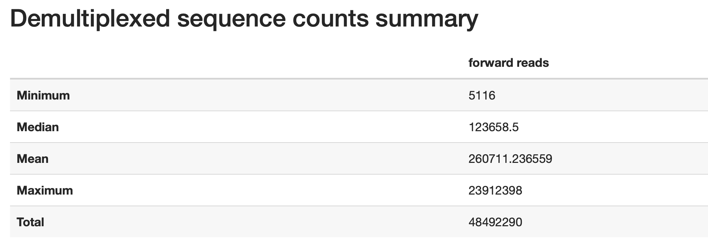
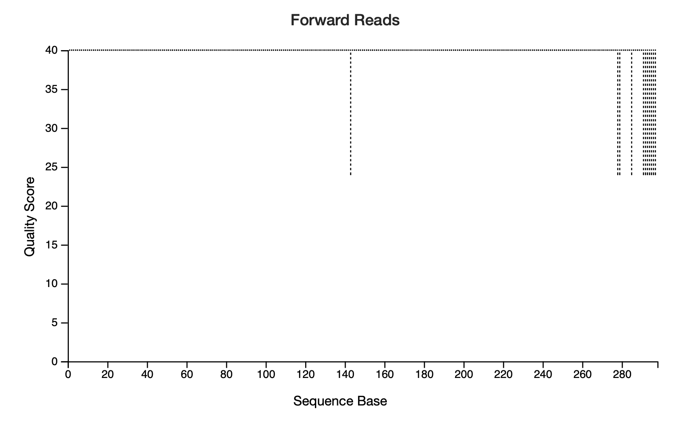
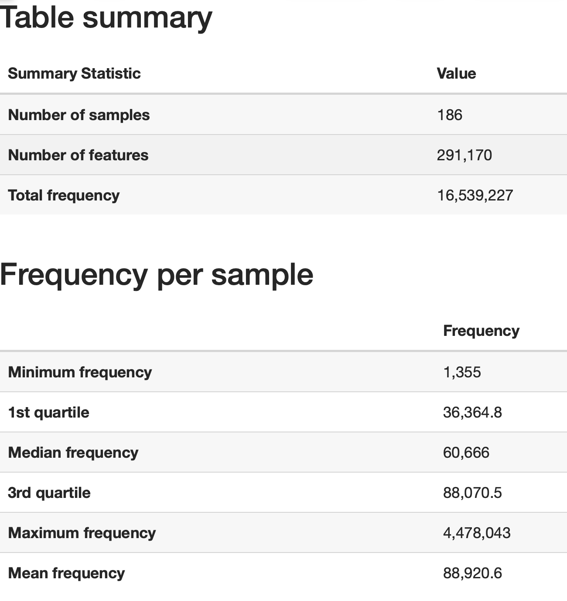
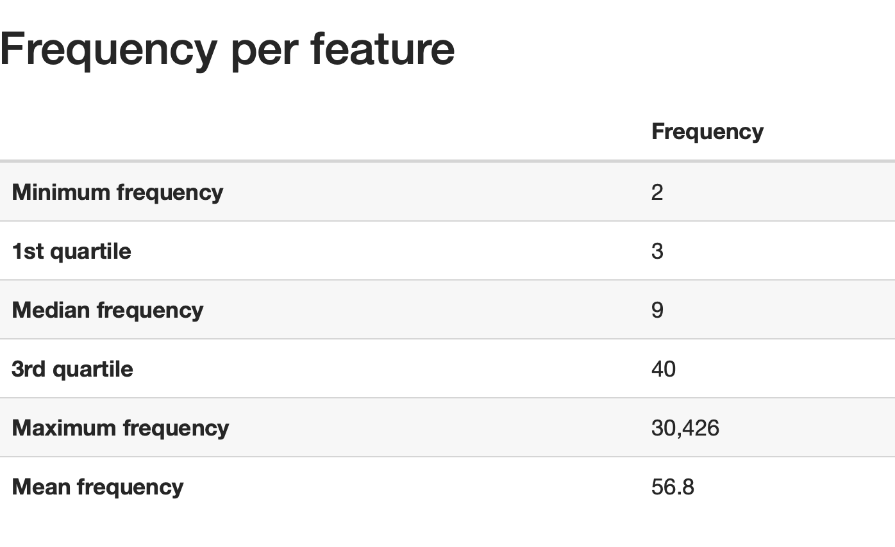
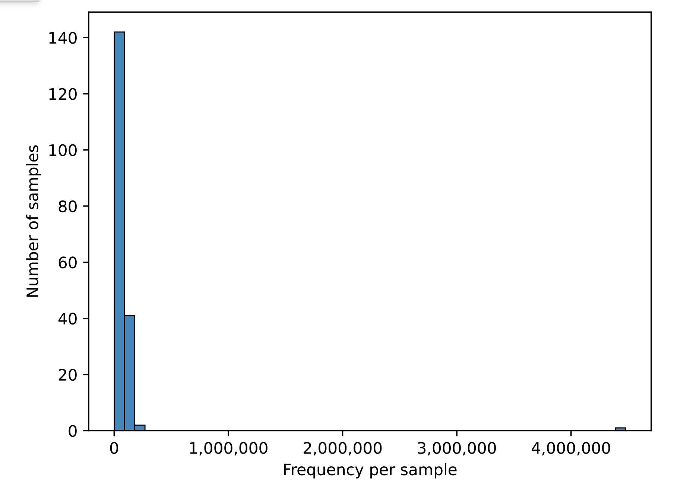
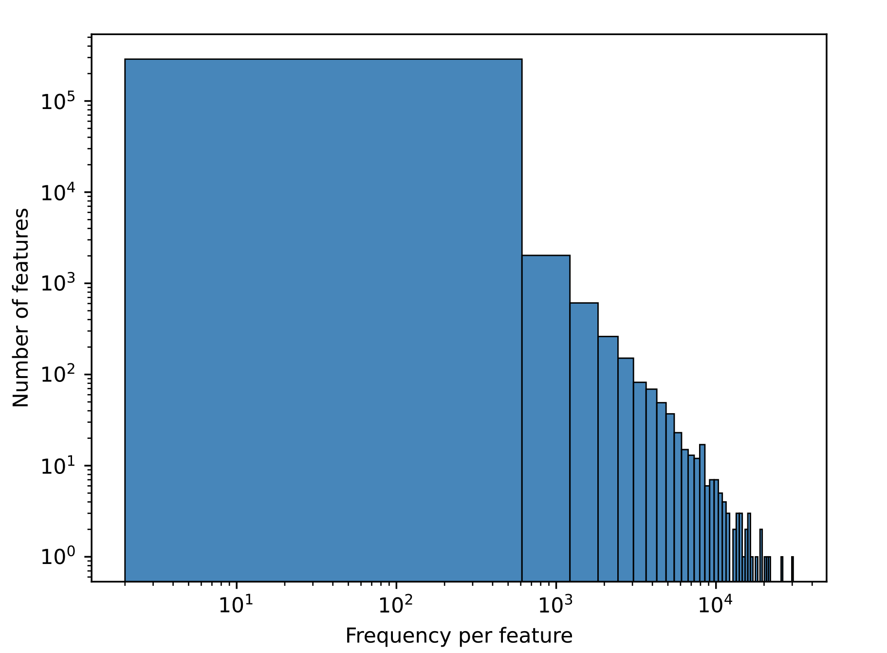
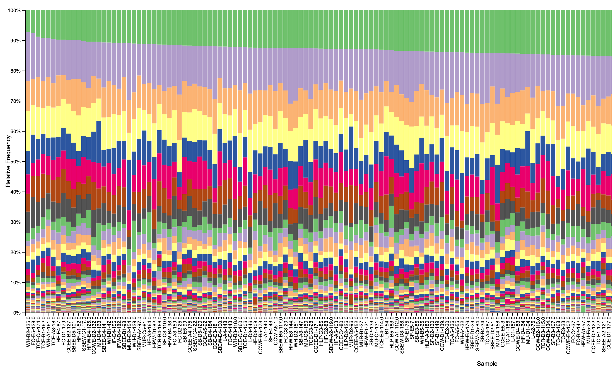

# Qiime2 Report

## Metadata and Sequence Information

***note: All files ending with .qzv are visualizations and can be viewed on [https://view.qiime2.org](https://view.qiime2.org)***

- Metadata submitted: [Nachusa_16s_all_metadata_edited2.tsv]()

- Sequences submitted:  **Forward**

- Initial Sequence statistics (Feature Table): [demultiplexed-seqs2.qzv]()

### Quality Plot

Quality drops around sequence base 140 and drops again at 280. **Quality scores >Q25 are the benchmark**.

## Denoising and Sequence Variants

- Denoiser used: **DADA2**

- Length was truncated to **275**

- Denoising statistics .tsv file can be downloaded from [https://view.qiime2.org](https://view.qiime2.org): [denoising-stats.qzv]()

- Representative sequences: [rep-seqs.qzv]() 

- Feature table statistics: [table-dada2.qzv]()

## Visualizations

- Database used for taxanomic classification: **greengenes**

- taxonomic mapping from sequences .tsv file can be downloaded from **Qiime2 Viewer**: [taxonomy_greengenes_dada2.qzv]()

- Interactive Bar Plot was filtered, removing unknown Bacteria: [taxa-bar-plot_final-filtered_dada2.qzv]()

sdsds 
