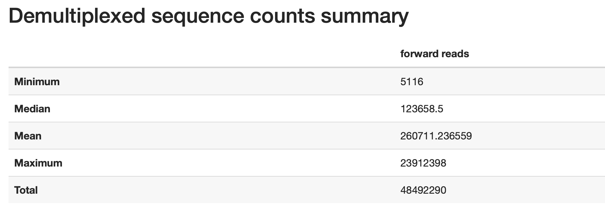
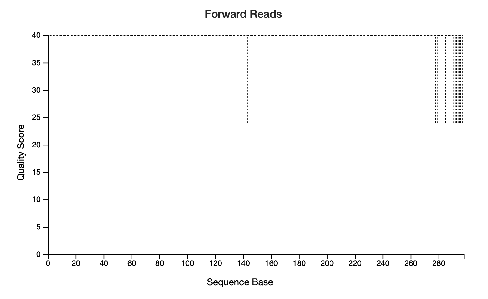
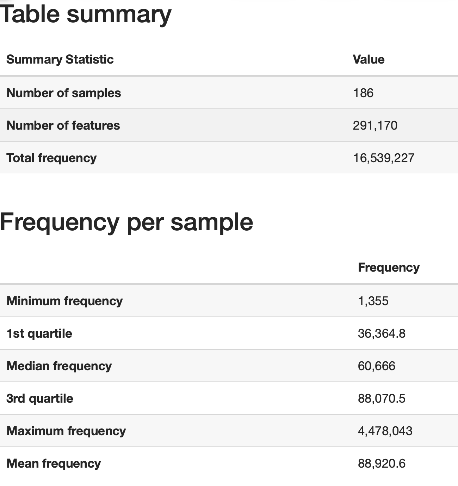
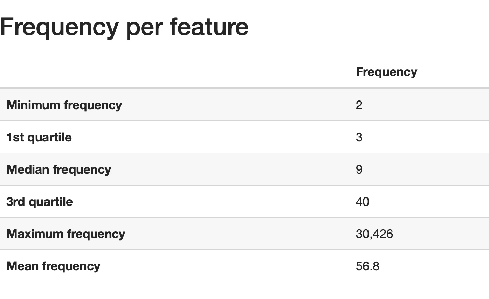
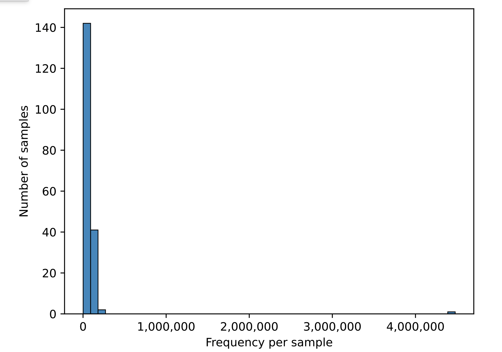
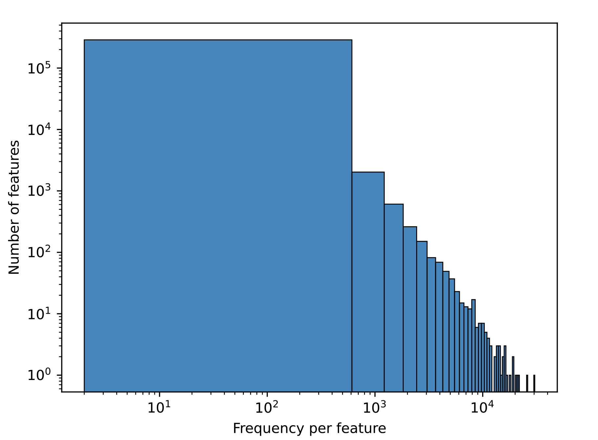
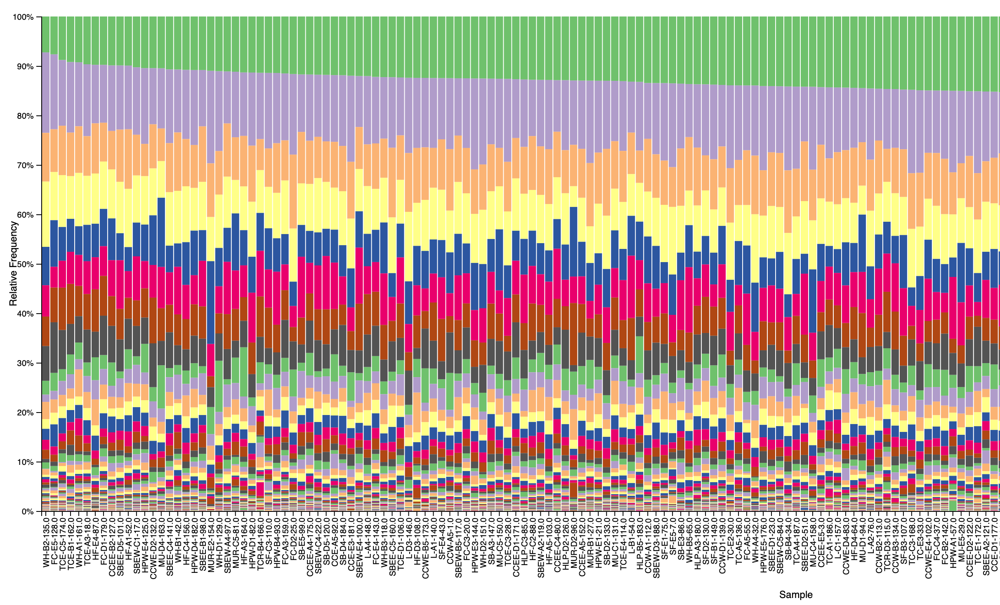

# Results

## QIIME2 Report

## Metadata and Sequence Information

***note: All files ending with .qzv are visualizations and can be viewed on [https://view.qiime2.org](https://view.qiime2.org)***

- Metadata submitted: [Nachusa_16s_all_metadata_edited2.tsv]()

- Sequences submitted:  **Forward**

- Initial Sequence statistics (Feature Table): [demultiplexed-seqs2.qzv]()

### Quality Plot

Quality drops around sequence base 140 and drops again at 280. **Quality scores >Q25 are the benchmark**.

## Denoising and Sequence Variants

- Denoiser used: **DADA2**

- Length was truncated to **275**

- Denoising statistics .tsv file can be downloaded from [https://view.qiime2.org](https://view.qiime2.org): [denoising-stats.qzv]()

- Representative sequences: [rep-seqs.qzv]() 

- Feature table statistics: [table-dada2.qzv]()

## Visualizations

- Database used for taxanomic classification: **greengenes**

- taxonomic mapping from sequences .tsv file can be downloaded from **Qiime2 Viewer**: [taxonomy_greengenes_dada2.qzv]()

- Interactive Bar Plot was filtered, removing unknown Bacteria: [taxa-bar-plot_final-filtered_dada2.qzv]()

***

## Principal Component Analysis (PCA)

***

## Random Forest Classification and Regression 

### <u>Classification</u>

Categorical Environmental Features Used

- site

- quadrat

- site type

- restoration year

- bison

- fire 2022

 **$R^2$** - measures the proportion of variance in your data explained by a model

 **Root Meaned Squared Error (RMSE)** - calculates the square root of the average squared differences between your predicted values and the actual observed values, closer to 0 means the predictions match the actual data 

***Genus***

|  | Mean | Top 5 species/Precision/Recall |
| --- | --- | --- |
| **Site** | 0.300 |  |
| **Quadrat** | 0.100 |  |
| **Site Type** | NA | NA |
| **Restoration Year** | 0.367 | Row 2, Cell 3 |
| **Bison** | 0.733 | Row 2, Cell 3 |
| **Fire 2022** | 0.700 | Row 2, Cell 3 |

### <u>Regression</u> 

***
